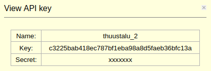
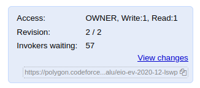
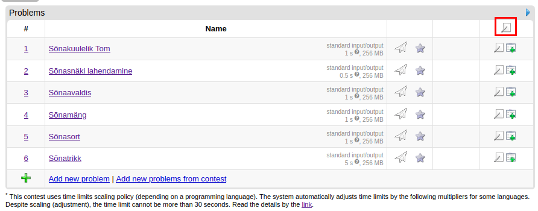
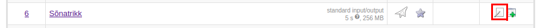
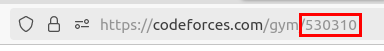

# CMS to Polygon export tool

This tool is for exporting Estonian informatics problems from CMS format to
[Polygon](https://polygon.codeforces.com/). Polygon is a task  preparation
system from the creators of Codeforces, and it is the easiest way to upload
problems to our archive that is hosted at Codeforces.

We use a modified version of the so-called "[Italian format](https://cms.readthedocs.io/en/v1.4/External%20contest%20formats.html#italian-import-format)".

## Dependencies

This thing is not really packaged properly, feel free to submit a PR to make
this cleaner. 

Python libraries:

- [polygon-py](https://github.com/citxx/polygon-py)
- [TexSoup](https://github.com/alvinwan/TexSoup)
- [pyyaml](https://pyyaml.org/)

Accessible from command line:

- ImageMagick
- g++
- gcc
- A Python 3 interpreter accessible as `pypy3`
- A Python 2 interpreter accessible as `python2`

The last four are applicable only if you are uploading solutions in the
respective languages.

## Running

To start the upload process, navigate to the directory of the task (It either
has a `task.yaml` file or there is a `[task-short-name].yaml` file in the parent
directory). Then run this script. This tool depends on having the correct
working directory. It keeps its own data under the polygon/ subfolder but
doesn't edit any other files.

It's recommended to add the root directory of this repository to your `PATH`
variable so you can use `cms2pg` as a normal command-line command.

To create a task on Polygon, you need a Polygon account and an API key. To get
your API key, navigate Settings -> New API key -> (after creating) View. You'll
see something like this:



This tool reads the API key from `~/.cms2pg/auth.json`. You have to create it;
it has the following format:

```json
{
    "key": "c3225bab418ec787bf1eba98a8d5faeb36bfc13a",
    "secret": "xxxxxxx"
}
```

## Task export process

As mentioned above, navigate to the task directory and execute `cms2pg`.

### Basic info

First, the script reads the `task.yaml` file and asks you to confirm some basic
information (scoring type, is interactive, is output-only). The detection is
generally reliable, but it can fail to properly detect whether the task is
interactive, as there is no actual flag for that.

The `GroupSumCond` scoring type is not supported; for now, you'll have to edit
the `task.yaml` to be `GroupSum` and remove the `S`, `U`, `C` suffixes from
`gen/GEN`.

Next, the script attempts to create the problem on Polygon. The problem name is
`eio-[contest type]-[year]-[month]-[task short name]`, e.g.
`eio-ev-2020-12-lswp`. If a problem with that name already exists, it will warn
you, but this is generally OK as the duplicate name is probably just an earlier
attempt to run this script.

Next, we export basic information: time limit, memory limit, I/O files and the
interactive flag. This is pretty self-explanatory, but it should be noted that
time limits are restricted to be between 0.25 and 15 seconds and must be
multiples of 50 milliseconds. The script handles that, but beware of breaking
the task if you have unusually high or low time limits.

Separate time limits for Python (or interpreted languages) are not supported on
Codeforces, the replacement for that is using a  _time limits scaling policy_
(see below).

### Tests

A **major limitation** of Codeforces is that it has no concept of an "answer 
file". You cannot upload a file and say that "this is the correct output for 
test `i`". The correct output for a given test case is whatever the model
solution prints.

This presents some issues:

- We need to validate that the correct solution gives the exact answers in the
`output` directory. We do that in the next step, but it does mean that there
actually needs to be a model solution.
- Sometimes, the files in the `output` directory aren't correct outputs at all,
but instead "hint" files that the checker will use to assess the correctness of
the solution. If that is the case, you'll need to rework the checker logic. In
some cases (e.g. approximation algorithms), you  need to think more creatively.
- Output-only problems may need a more creative approach (see below).

Before this script starts to upload test files, you'll be prompted with
this:

```
The next step requires manual intervention (API doesn't support the first two steps).
Go to the Tests section and:
- UNCHECK 'Tests well-formed' if task may contain unusual input files (e.g. multiple consecutive spaces),
- SELECT 'Treat points from checker as a percent' under 'Enable points',
- CHECK 'Enable groups'
- DELETE any existing tests.
```

- The UNCHECK step should be unnecessary in most cases; the exception is mostly
whitespace-sensitive test cases. Use it only in those extreme cases.
- The DELETE step is also mostly unnecessary. We are overwriting the tests, not
appending. It's only necessary if you have more tests from an earlier attempt
than the problem actually has.

The script reads the `gen/GEN` file to obtain the subtasks. In some older
problems, there may not be a `gen/GEN` file if the scoring type is `Sum`, in
that case, just create it.

`GroupSum` and `GroupMin` are both supported, but Polygon only lets you specify
a test's value up to 2 decimal places, so in `GroupSum` tasks the point values
are slightly rounded (down for the first `n - 1` tests of a group, the last gets
the remainder)

If Polygon complains about multiple test cases being equal, go to General Info ->
Advanced and uncheck "Skip duplicated tests validation". Then rerun the script.

### Checker

Next, the script uploads the checker. If there is no `check` directory, we
assume that this task uses the default checker, which is roughly equivalent to
the `std::lcmp.cpp` checker in Polygon. If that is the case, the script sets that
as the checker and nothing more needs to be done.

Otherwise, you need to modify the checker to work with Polygon. Here are the
main differences.

Command-line arguments are different. In CMS:

```
<input-file> <answer-file> <output-file>
```

In Polygon:

```
<input-file> <output-file> <answer-file>
```

In CMS, the score is written to stdout and the comment to stderr. In Polygon,
the basic status is communicated as an exit code: `0` for Accepted, `1` for
Wrong Answer, `7` for partial credit (less used: `2` for Presentation Error,
`3` for judgment failure). The comment is written to stderr. If the exit code is
`7`, the comment must start with `points n ` where `n` is an **integer** from 0
to 100.

So, the equivalents of the following CMS exit conditions:

```cpp
std::cout << 0 << '\n';
std::cerr << "Wrong answer" << '\n';

std::cout << 0.55 << '\n';
std::cerr << "Answer is correct but not optimal" << '\n';

std::cout << 1 << '\n';
std::cerr << "Accepted" << '\n';
```

are

```cpp
std::cerr << "Wrong answer" << '\n';
std::exit(1);

std::cerr << "points 55 Answer is correct but not optimal" << '\n';
std::exit(7);

std::cerr << "Accepted" << '\n';
std::exit(0);
```

It's also fine to use `points 0` and `points 100` with exit code `7` to
communicate a completely wrong and a completely correct answer.

If the checker is written using `testlib.h`, you don't have to do anything: the
checker will be compiled with Codeforces's version of `testlib.h` and will use
the correct protocol.

Otherwise, you'll have to manually edit the checker to work. This script will
prompt you to do so; you'll have to save it as the only `.cpp` file in the
`polygon/checker/` directory. If the checker is in another language (e.g.
Python, Pascal and C# are sometimes used), skip this step and upload it
manually.

### Solution

As mentioned above, a main correct solution is required on Polygon. As the next
step, this script will upload it. To do so, it searches for all source code
files in the `solution/` and `sol/` directories and asks you to select the
correct one.

Since it is not always clear which solution is the correct one, the script will
also verify it: we run the solution on each test case, check if it exactly
matches the correct output, check if the checker accepts it, and also check if
the checker accepts it when the output and answer are reversed (this last part
is useful to make sure the files in the output directory are actual outputs and
not hints).

### Statements

Statements are tricky. HTML statements on Codeforces are generated from LaTeX,
but only a restricted subset of LaTeX commands are actually supported. Also,
Codeforces has separate sections for input, output, scoring, notes etc. This
script handles both issues pretty well: we replace most commonly used and
unsupported commands with replacements, and partition the statement mostly
correctly. Images are also handled if they are in the `.png` or `.pdf` format
(the latter ones get converted to `.png`).

However, it is generally necessary to manually review the statement. The most
common issue is that many tasks have interleaved examples and example
explanations, which is not possible to do on Codeforces. All LaTeX markup after
the first example will be put into the Notes section, which means that sample
explanations get concatenated. In that case, just add a short introduction to
each explanation: "in the first example", "in the second example", ...

Other common issues:

- Codeforces will replace `<<` and `>>` with French quotes, even in environments
like `lstlisting` or the `\t` macro. Other "special characters" may need
attention too.
- Figures created with the `\joon` macro (Metapost?) are not supported, neither
are figures drawn inline with TikZ. The easiest way is to screenshot them and
upload the pictures in Polygon.

If there are no `statement.[lang].tex` files in `statement`, this tool will look
for `statement.[lang].pdf` files instead and upload them as images. This is not
supported very well and requires manual work often (e.g. multiple pages, samples).

Example tests are also uploaded in this step. In Polygon, you can specify the
output for examples displayed in the problem statement (which may be different
from the one generated by the solution). We do this here.

Codeforces UI will only show the English and Russian statements. Because we want
to show the Estonian statements, we set the language of Estonian statements to
English, and the language of English statements to Other.

### Packaging

To upload a problem prepared in Polygon to Codeforces, the changes need to be
committed and a "package" to be created. This script will generally initiate it,
but be ready to handle errors.

## Output-only problems

Polygon doesn't really support output-only problems. However, any problem can be
marked as output-only in Codeforces, so output-only problems can still be created
with some creativity.

The main issue is the lack of a concept of "correct output files" in Polygon.
Suppose for instance that you have an output-only task like TSP  and you have
generated the true answers using an expensive ILP solver before the contest. Or
the grading scheme is "whoever got the best result in the actual contest gets 
100p, the rest get points proportionally". How do you give points without having
any access to such output files?

This script offers two strategies to handle this.

### Concatenation

Notice that the "input" files in Polygon are only used in the checking process.
(The input given  to the participant as a ZIP is separate from those). Thus, we
can add the expected output to the input file. 

The actual input is separated from the expected output by a user-chosen separator.
This script will upload such concatenated tests to Polygon and will upload the
following as the main correct solution:

```cpp
#define SEPARATOR [something] // this part is generated dynamically
#include <iostream>
#include <iomanip>

using namespace std;

int main () {
  ios::sync_with_stdio(false);
  cin.tie(0);

  bool separator_seen = false;
  char c;
  while (cin >> noskipws >> c) {
    if (separator_seen) {
      cout << c;
    } else if (c == SEPARATOR) {
      separator_seen = true;
    }
  }
}
```

Limitations:

- Codeforces's UI will show the input to the participant in the detailed view,
but only the first 1000 or so characters. If the actual input is very short,
using this strategy may spoil the problem.
- You will need to ensure that this concatenation doesn't break the checker
(i.e. you can't read the input "to the end")
- This doesn't work in tasks where it's impossible to get maximum points (the
main correct solution is expected to get maximum points)

### Token

We generate a random token. The input files uploaded to Polygon are the actual
input files. We will upload this as the main correct solution:

```cpp
#define TOKEN [something] // this part is generated dynamically
#include <iostream>

using namespace std;

int main () {
  for (int i = 0; i < 5; i++)
    cout << "-1 ";
  cout << "this is just a really dumb hack to make output-only work. ";
  cout << "and this next part is just filler so you don't find out how to get accepted ";
  cout << "by looking at the input/output pairs in the judging log. ";
  for (int i = 0; i < 10000; i++)
    cout << "filler ";
  cout << TOKEN << '\\n';
}
```

Limitations:

- You will need to modify the checker to recognize the token.
- This doesn't work in tasks where the checker needs to inspect the correct
answer.

### Other output-only concerns

If a problem is marked output-only on Codeforces, the participant must upload a
ZIP file with file names from (e.g.) `01.out` to `25.out`. You will need to
mention this in the statement. It's also probably best to use the same scheme
for input files.

You will need to manually upload the input files that will be displayed to the
participant in the contest system. To do that, first go Files -> Attachments,
and upload your files there. Then, go to Packages -> Materials -> Add Material.
Name it e.g. "tests", choose publishing "WITH_STATEMENT", then "Add Item".
Select "Attachment files" from the dropdown and select all, then save.

## Interactive problems

In recent EIO editions, interactive problems have been implemented using custom
`batchmanager`s. A `batchmanager` is a program that is, for each test, run with
the inputs

```bash
batchmanager [input-file] [output-file] [solution-executable]
```

and can do whatever it wants with this data. We typically fork the process and
load the solution with `execv` in the child.

This doesn't work in Codeforces. There, an interactor is simply a program that
communicates with the solution via standard input and output. It's probably
easiest to just reimplement the interactor using 
[their guide](https://codeforces.com/blog/entry/18455). It's not that much work:
you can usually just add `#include "testlib.h"` to your program, call
`registerInteraction` in your main method and if there is a `spawn` class,
rewrite the `recv` and `send` methods to read from `inf` and write to
`std::cout`.

## Uploading the contest to Codeforces

You need to have createad a package for each problem, as shown above. You also
need to give the `codeforces` user READ access to each problem.

Go to Codeforces, then Gym -> Mashups -> Create new mashup. If you don't have
permissions to do that, ask Tähvend (or any GM) to give permissions or use the
`eio` account. Fill the required fields. For "name", follow the convention: it
is "EIO yyyy-yy contest-type", e.g.

- EIO 2023-24 lõppvoor
- EIO 2023-24 eelvoor
- EIO 2023-24 lahtine võistlus

To add problems, copy the problem's canonical Polygon URL to the textbox. It can
be seen in this box:



Once the contest is created, set some basic settings in the "Edit" menu.
(Important options are in bold)

- **Contest format: IOI**
- Start and end times: you can fill those, but don't worry about them too much;
setting a very old start time (more than a couple of years) is unsupported.
- Contest testdata policy: Show complete
- **Use time limits scaling policy: check**
- Season: the season
- Contest type: official school contest
- Country: Estonia
- Difficulty: 3 stars for finals and open contests, 2 stars for preliminary

There is an annoying double-encoding bug on Codeforces: the names of contests
can get mangled, so before saving, check that `võistlus` has not become
`v&otilde;istlus`.

Go back to the Problems tab and click the edit icon at the top of the problem
list. Renumerate the problems using Arabic numerals. In older contests with
multiple divisions (not the recent ones where one division is a prefix of the
other), use letters to denote the division, e.g. A1, A2, A3, B1, B2, B3. The
letters are:

- A for põhikool, noorem
- B for gümnaasium, vanem, algajad
- C for edasijõudnud



If any problems are output-only, you need to flag them as such now. Click the
"edit" button of the problem you want to make output-only and check the "Output 
only" checkbox



Finally, add the contest to the archive group, e.g. at
https://codeforces.com/group/RzG3uwfRM6/ You need to ask for Manager access if
you don't already have it from someone who already is a manager. Click "Add 
contest to group" and copy the ID of the mashup you created to the box.

